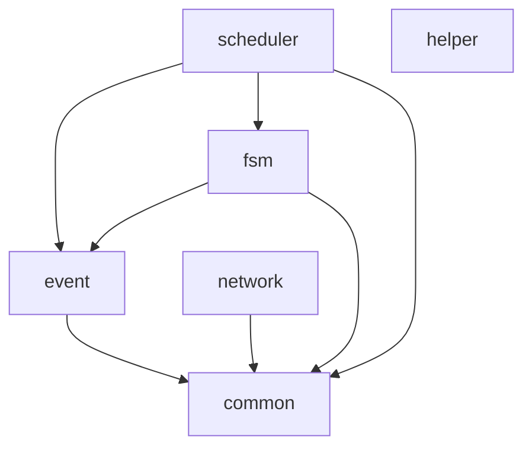
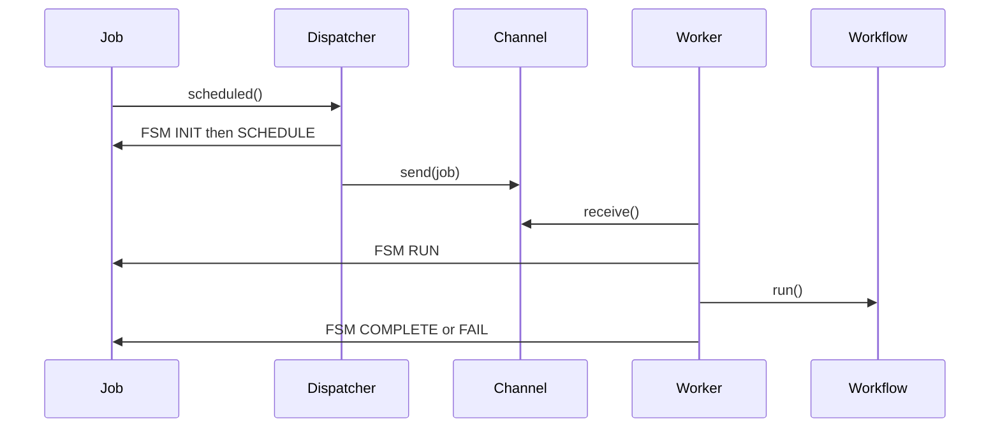

# Architecture

PyPepper is a layered toolkit. Domains stay mostly independent; the main composition path is **scheduler → event + fsm + common**. Network depends only on common.

## Layering

| Package | Depends on | Notes |
|---------|------------|-------|
| `common` | (none of other domains) | Shared kernel |
| `event` | `common` | Signed events |
| `fsm` | `event`, `errors` | Generic state machine |
| `scheduler` | `common`, `event`, `fsm` | Job pipeline |
| `network` | `common` | HTTP + SSE; no scheduler coupling |
| `helper` | (standalone) | DB connect helpers only |

## Extension points

Implement an interface and register it:

| Interface | Location | Use |
|-----------|----------|-----|
| `ITaskHandler` | `pypepper.network.http.interfaces` | Add HTTP routes / middleware |
| `ISSEHandler` | `pypepper.network.http.sse.interfaces` | Custom SSE streams |
| `IExecutor` / `CallableExecutor` | `pypepper.scheduler.executor` | Task work units |
| `fsm.Options` + `Transition` | `pypepper.fsm.fsm` | Custom machines |
| `Loader.register` / `load` | `pypepper.loader` | Named init hooks |

## Explicit singletons

Process-wide registries must be intentional, not accidental shared class dicts:

| Symbol | Module |
|--------|--------|
| `config` | `pypepper.common.config` |
| `log` | `pypepper.common.log` |
| `loader` | `pypepper.loader` |
| `dispatcher` | `pypepper.scheduler.job` |
| `manager` | `pypepper.scheduler.channel` |
| `connection_manager` | `pypepper.network.http.sse.connection` |

Mutable instance state belongs in `__init__` / `__new__`, not as class attributes.
CI enforces this via `scripts/check_mutable_class_attrs.py` (`make check`).

## Scheduler call chain

## Config surface

Runtime YAML lives in `conf/app.config.yaml` (cluster, network, log, SSE, tracing, `custom`).
Some config models (for example heartbeat / JSON-RPC proxy) are reserved and not yet wired to servers.

## Observability

Optional OpenTelemetry tracing is configured under `tracing` (default off). See [Tracing](guides/tracing.md).
HTTP requests and `Workflow.run` emit spans when enabled; Jaeger all-in-one is available via `devenv/dev.yaml` for local UI only.

## Type checking

`make lint` runs mypy on `pypepper/`. Selected static paths (crypto, HTTP/SSE skeleton, scheduler structure) additionally enable `disallow_untyped_defs` and `warn_return_any` via `[[tool.mypy.overrides]]` in `pyproject.toml`. Dynamic boundaries (config/`Box`, FSM handlers, loader, executor/channel) and third-party stubs remain on the looser global settings.
